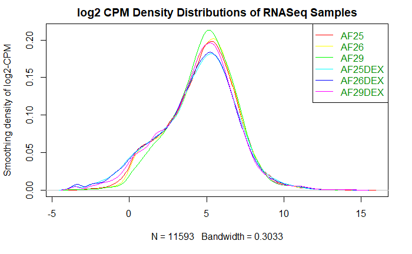

```{=html}
<style type="text/css">
  body{
  font-size: 11.5pt;
}
</style>
```

------------------------------------------------------------------------

## Report Set-up

Load all required packages for this report and define some global customization settings.

```{r message = FALSE, warning=FALSE}
# for knitting the .rmd file to .html
if (! requireNamespace("knitr", quietly = TRUE)) {
  install.packages("knitr")
}
if (! requireNamespace("kableExtra", quietly = TRUE)) {
  install.packages("kableExtra")
}

# for creating models and analyzing expression data
if (! requireNamespace("edgeR", quietly = TRUE)) {
  BiocManager::install("edgeR")
}
if (! requireNamespace("limma", quietly = TRUE)) {
  BiocManager::install("limma")
}
if (! requireNamespace("dplyr", quietly = TRUE)) {
  install.packages("dplyr")
}
if (! requireNamespace("gprofiler2", quietly = TRUE)) {
  install.packages("gprofiler2")
}

# for creating plots
if (! requireNamespace("ggplot2", quietly = TRUE)) {
  install.packages("ggplot2")
}
if (! requireNamespace("ggrepel", quietly = TRUE)) {
  install.packages("ggrepel")
}
if (! requireNamespace("ComplexHeatmap", quietly = TRUE)) {
  BiocManager::install("ComplexHeatmap")
}
if (! requireNamespace("circlize", quietly = TRUE)) {
  BiocManager::install("circlize")
}

library(edgeR)
library(dplyr)
library(ggplot2)

# wraps lines that are too long
knitr::opts_chunk$set(tidy.opts=list(width.cutoff=80), tidy=TRUE)
# set default behaviors for all chunks
knitr::opts_chunk$set(warning = FALSE, message = FALSE)
```

All table and figure outputs in this report are rendered using the knitr package @knitr, and kableExtra package @kableExtra for styling. Some codes in this report are adapted from Lecture 6 - Differential Expression @lec6 and Lecture 7 - Annotation Resources and Prelim ORA @lec7.

------------------------------------------------------------------------

# Introduction

## Background on the Data Set

Glucocorticoids (GC) is a class of steroid hormones that plays a role in regulating the immune system and certain aspects of the immune function, such as inflammation. The most common naturally-produced GC hormone in humans is cortisol, which are produced by the adrenal glands. Due to GC's potent anti-inflammatory effects, several synthetic forms of GC are used as immunosuppressive drugs to treat various medical conditions such as asthma, allergies, autoimmune disorders, and cancer. @GSE-paper

The data set used in this report comes from Quatrini et al. (2022)'s paper: **Glucocorticoids inhibit human hematopoietic stem cell differentiation toward a common ILC precursor** @GSE-paper, where they analyzed the the role of GC on regulating innate lymphoid cells (ILCs) differentiation, including cytotoxic natural killer cells and helper ILCs, from human hematopoietic stem cells (HSCs). The RNA-seq data set used in this report is a part of the overall study; it evaluates the effect of the presence of Dexamethasone (DEX), a glucocorticoid medication, on gene expressions of HSCs. The raw data set is downloaded from the NCBI Gene Expression Omnibus, with ID [**GSE186950**](https://www.ncbi.nlm.nih.gov/geo/query/acc.cgi?acc=GSE186950). @GSE

## Data Processing and Normalization

In [Assignment 1](https://github.com/bcb420-2023/JunNi_Du/blob/main/a1.Rmd), I performed initial pre-processing and normalization of the data set. The raw data set contains 2 groups, control and conditioned (DEX), with 3 samples in each group: AF25, AF26, AF29. The data set initially contained gene expressions of 58683 genes, but 46243 genes were removed due to low counts with less than 1 count per million in at least 3 samples, leaving 12440 genes.

In the original data set, genes are labeled in a mix of HUGO gene symbols, GenBank accession IDs, EMBL identifiers, etc. Using the biomaRt  package @biomaRt, we attempted to map non-HUGO identifiers to their corresponding HUGO gene symbols, but had to discard 847 (6.8%) genes with no matches, leaving a final set of 11593 unique genes. 

```{r warning=FALSE, message=FALSE, out.width = "75%"}

```

**Figure 1.** *log2 CPM Distributions of gene expressions of each sample in the data set, after filtering out genes with low-counts or without HUGO gene symbol match, and before TMM normalization. This figure is adapted from Assignment 1 with slight aesthetic modifications.*

As shown in Fig.1, The filtered data set is approximately normally distributed with no outlier samples, and therefore we normalized the data using the Trimmed Mean of M-values (TMM) method, via the edgeR package. @edgeR

Since we'll be using functions from the edgeR package to build the differential expression models in this report, the DGEList object is needed. Therefore, we'll load the filtered data set (in counts), which excludes the removed genes as outlined above, via an .rds file, and then repeat the TMM-normalization process. The `raw_fltr_matrix.rds` file can be generated by running `saveRDS(raw_fltr_matrix, 'raw_fltr_matrix.rds')` after running all code chunks in [a1.Rmd](https://github.com/bcb420-2023/JunNi_Du/blob/main/a1.Rmd).

```{r warning=FALSE, message=FALSE, tidy=TRUE}
raw_fltr_matrix <- readRDS('raw_fltr_matrix.rds')

# group each sample into either the control (CTRL) or the conditioned (DEX) group.
groups <- data.frame(matrix(NA, nrow = 6, ncol = 2))
for (i in colnames(raw_fltr_matrix)) {
  idx <- match(i, colnames(raw_fltr_matrix))
  if(grepl("DEX", i)) {
    groups[idx,1] <- "DEX"
    groups[idx,2] <- substring(i,1,4)
  } else {
    groups[idx,1] <- "CTRL"
    groups[idx,2] <- substring(i,1,4)
  }
}
rownames(groups) <- colnames(raw_fltr_matrix)
colnames(groups) <- c('treatment', 'sample')
kableExtra::kable_paper(knitr::kable(groups, format = "html"))
```

**Table 1.** *An Overview of the groups in the data set. The data set contains two factors: 1) Treatment, where each sample is catogorized into either the control (CTRL) or the conditioned (DEX); 2) Sample, where each sample belongs to one of the three biological entities: AF25, AF26, and AF29. *

```{r warning=FALSE, message=FALSE, tidy=TRUE}
# Normalization via the TMM method
dge <- edgeR::DGEList(counts = raw_fltr_matrix, group = groups$treatment)

# calculate normalization factor
dge <- calcNormFactors(dge)
# get the normalized data
normalized_cpm <- cpm(dge)

# A preview of the normalized data.
kableExtra::kable_paper(knitr::kable(data.frame(head(normalized_cpm)), format = "html"))
```

**Table 2.** *A preview of the normalized data set, in counts per million (CPM). Each row represents a unique gene as identified by their HUGO gene symbol in the row name, and each column represents a sample in the data set.*

------------------------------------------------------------------------

# Differential Gene Expression

## Global Overview of Differential Gene Expression

To start, we first create a heat map of gene expressions across all genes and all samples in the data set. This allows us to get an rough idea of the expression change patterns at-large. All heatmaps in this report are generated using the ComplexHeatmap package @heatmap and the circlize package @circ for generating interpolated colours.

```{r warning=FALSE, message=FALSE}
# Create a row-normalized heatmap matrix
heatmap_matrix <- t(scale(t(normalized_cpm)))
```

The range of values in our heatmap matrix is [`r range(heatmap_matrix)`].\
The two ends are approximately the same in magnitude, and so we use 0 as the middle point and set the color scheme to be "blue - white - red" where blue corresponds to lower gene expressions and red corresponds to higher gene expressions.

```{r warning=FALSE, message=FALSE, tidy=TRUE}
heatmap_col = circlize::colorRamp2(c(min(heatmap_matrix), 0, max(heatmap_matrix)), 
                                   c("blue", "white", "red"))  

# Create the heatmap
gene_express_heatmap <- ComplexHeatmap::Heatmap(as.matrix(heatmap_matrix),
                                           show_row_dend = TRUE,
                                           show_column_dend = TRUE,
                                           col = heatmap_col,
                                           show_column_names = TRUE,
                                           show_row_names = FALSE,
                                           show_heatmap_legend = TRUE,
                                           name="row-normalized gene \nexpression (CPM)",
                                           km = 3,
  column_title = "Row-Normalized Differential Gene Expressions (in CPM) In Each Sample")
gene_express_heatmap
```

**Figure 2.** *Heatmap of row-normalized gene expressions, in counts-per-million (CPM), in each sample of the data set. Column-wise, each sample is hierarchically clustered based on the similarity of their gene expressions. Row-wise, each gene is hierarchically clustered based on their expressions across the samples. A k-mean clustering of size 3 is applied to the rows to cluster genes into 3 groups based on similarity in expressions.*

In Fig.2, column-wise dendrogram shows that the six samples were cleanly clustered into two groups, control (CTRL) and conditioned (DEX). Row-wise, although the clustering pattern between individual genes are too difficult to identify, the three main groups as clustered by k-means do express some distinct differences between each other, andto an extent, between the control and conditioned group in each cluster.

An interesting note is that between the three biological entities (AF25, AF26, AF29), AF29 exhibits some unique expression patterns that differs from AF25 and AF26, in both the control and conditioned samples. The original paper where the data set came from did not have mentioning nor explanations to this difference, so it is likely that the difference is purely based on biological variability between the samples. Nevertheless, to verify, we built a multidimensional scaling (MDS) plot using the limma package @limma to illustrate the distances between samples.

```{r warning=FALSE, message=FALSE, tidy=TRUE}
limma::plotMDS(heatmap_matrix, col=c('blue','red')[factor(groups$treatment)],
        main = 'Distance Between Samples')
```

**Figure 3.** *Multidimensional scaling (MDS) plot of samples in the data set. Distances on the plot are approximations of the typical log2 fold changes between the samples. Samples in the control (CTRL) group are colored blue and samples in the conditioned (DEX) group are colored red.*

The MDS plot (Fig.3) supports the clustering patterns found in the heat map, both between the groups and between samples in each group. Namely, samples in the control group are clustered away from the conditioned group, and with in each of the two main clusters, AF29 are positioned farther away from AF25 and AF26. This aligns with the unqiue gene expression profiles of AF29 that observed in the heat map.

## Model Design

### Model #1: Treatment-Only Model Using Exact Test Model From edgeR

Without accounting for the biological variabilities between samples, our data set is quite simple with only two groups: control and conditioned. Therefore, we'll first use the Exact Test model from the edgeR package @edgeR to test for the differential gene expressions between the two groups.

```{r warning=FALSE, message=FALSE, tidy=TRUE}
model_cond <- model.matrix(~ groups$treatment + 0)
colnames(model_cond) <- c('CTRL','DEX')
rownames(model_cond) <- colnames(normalized_cpm)
kableExtra::kable_paper(knitr::kable(model_cond, format = "html"))
```

**Table 3.** *Design of Model #1. In this model, only the treatment condition is considered and each sample belongs to either CTRL or DEX (conditioned).*

```{r warning=FALSE, message=FALSE, tidy=TRUE}
dge_cond <- edgeR::estimateDisp(dge, model_cond)

et <- edgeR::exactTest(dge_cond, pair=c("CTRL", "DEX"))

top_et <- topTags(et, sort.by = "PValue", n=nrow(normalized_cpm))
kableExtra::kable_paper(knitr::kable(top_et$table[1:10,], format = "html", digits=150))
```

**Table 4.** *A preview of the top 10 differentially-expressed genes (in order of ascending p-value) under the treatment-only exact test model.*

#### Model #1 Volcano Plot

To visualize the set of differentially expressed genes, we'll use a Volcano plot. A portion of the following code is adapted from [this tutorial](https://samdsblog.netlify.app/post/visualizing-volcano-plots-in-r/) @volplot_tut in terms of customization and gene label placements. The `%>%` shortcut from the dplyr package @dplyr was used for data manipulation, and the ggplot2 package @ggplot2 and the ggrepel package @ggrepel were used to generate the Volcano plots.


```{r warning=FALSE, message=FALSE, tidy=TRUE}
top_et_label <- top_et$table%>% mutate(
    Expression = case_when(logFC > 0 & FDR < 0.05 ~ "Up-regulated",
                           logFC < 0 & FDR < 0.05 ~ "Down-regulated",
                           TRUE ~ "Unchanged")
    )

# label the top five genes in either direction of change
top <- 5
top_genes_et <- bind_rows(
  top_et_label %>% 
    filter(Expression == 'Up-regulated') %>% 
    arrange(FDR, desc(abs(logFC))) %>% 
    head(top),
  top_et_label %>% 
    filter(Expression == 'Down-regulated') %>% 
    arrange(FDR, desc(abs(logFC))) %>% 
    head(top)
)

volplot_et <- ggplot2::ggplot(top_et_label, aes(logFC, -log(FDR,10))) +
  geom_point(aes(color = Expression), size = 0.6) +
  xlab(expression("log"[2]*"FC")) + 
  ylab(expression("-log"[10]*"FDR")) +
  scale_color_manual(values = c("dodgerblue3", "gray50", "firebrick3")) +
  guides(colour = guide_legend(override.aes = list(size=4))) 
volplot_et <- volplot_et +
  ggrepel::geom_label_repel(data = top_genes_et,
                   mapping = aes(logFC, -log(FDR,10), 
                                 label = rownames(top_genes_et)),
                   size = 3.5) +
  ggtitle('Volcano Plot of Differentially Expressed Genes Distribution in Model #1')
volplot_et
```

**Figure 4.** *Volcano plot of differentially expressed genes in Model #1, accounting for only the treatment variability using the Exact Test Model from edgeR. Differentially expressed genes are coloured based on direction of change with blue indicating down-regulated genes and red indicating up-regulated genes (FDR-corrected p<0.05). Genes with the top five log fold change (in magnitude) in either directions are labelled.*

#### Model #1 Heat Map

```{r warning=FALSE, message=FALSE, tidy=TRUE}
top_et_genes <- top_et[top_et$table$FDR < 0.05,]
top_et_genes <- rownames(top_et_genes$table)

heatmap_matrix_tophits_et <- heatmap_matrix[which(rownames(heatmap_matrix) %in% top_et_genes),]

heatmap_col = circlize::colorRamp2(c(min(heatmap_matrix_tophits_et), 
                                     0,
                                     max(heatmap_matrix_tophits_et)),
                                   c("blue", "white", "red"))

# Set colours
treat_colours <- c("orange", "darkblue")
names(treat_colours) <- c("DEX", "CTRL")

# Set annotations
treatment_col <- ComplexHeatmap::HeatmapAnnotation(df=data.frame(
  treatment = rep(c("CTRL", "DEX"), c(3, 3))),
  col = list(treatment = treat_colours))

model_1_heatmap <- ComplexHeatmap::Heatmap(as.matrix(heatmap_matrix_tophits_et),
                           cluster_rows = TRUE,
                           cluster_columns = FALSE,
                           show_row_dend = TRUE,
                           show_column_dend = FALSE,
                           col = heatmap_col,
                           show_column_names = TRUE,
                           show_row_names = FALSE,
                           show_heatmap_legend = TRUE,
                           top_annotation = treatment_col,
                           column_title = "Annotated Heatmap of Model #1",
                           name="row-normalized gene \nexpression (CPM)",
                           )
model_1_heatmap
```

**Figure 5.** *Annotated heatmap of differentially expressed genes in Model #1, comparing conditioned to control samples. Samples are annotated based on treatment conditions.*

### Model #2: Treatment + Sample Model Using Quasi-Liklihood Model From edgeR

Recall that in the global heatmap, we observed some differences in terms of gene expressions between the three biological entities. Although the paper did not mention this difference, we'll build another model to see how sample variability affect out results. We use the Quasi-Likelihood Model from the edgeR package @edgeR, and include both the treatment and sample conditions.

```{r warning=FALSE, message=FALSE, tidy=TRUE}
model_samp <- model.matrix(~ groups$sample + groups$treatment)
rownames(model_samp) <- colnames(normalized_cpm)
kableExtra::kable_paper(knitr::kable(model_samp, format = "simple"))
```

**Table 5.** *Design of Model #2. In this model, both the treatment and sample condition are considered and each sample belongs to one of (CTRL, DEX) as well as one of (AF25, AF26, AF29).*

```{r warning=FALSE, message=FALSE, tidy=TRUE}
# Estimate dispersion
dge_samp <- edgeR::estimateDisp(dge, model_samp)

# Fit the Quasi Likelihood Model
fit <- edgeR::glmQLFit(dge_samp, model_samp)
qlf <- edgeR::glmQLFTest(fit, coef='groups$treatmentDEX')
top_qlf <- topTags(qlf, sort.by = "PValue", n=nrow(normalized_cpm))

kableExtra::kable_paper(knitr::kable(top_qlf$table[1:10,], format = "html", digits=20))
```

**Table 6.** *A preview of the top 10 differentially-expressed genes (in order of ascending p-value) under the treatment+sample QLM model.*

#### Model #2 Volcano Plot

```{r warning=FALSE, message=FALSE, tidy=TRUE}
top_qlf_label <- top_qlf$table%>% mutate(
    Expression = case_when(logFC > 0 & FDR < 0.05 ~ "Up-regulated",
                           logFC < 0 & FDR < 0.05 ~ "Down-regulated",
                           TRUE ~ "Unchanged")
    )

# label the top five genes in either direction of change
top <- 5
top_genes_qlf <- bind_rows(
  top_qlf_label %>% 
    filter(Expression == 'Up-regulated') %>% 
    arrange(FDR, desc(abs(logFC))) %>% 
    head(top),
  top_qlf_label %>% 
    filter(Expression == 'Down-regulated') %>% 
    arrange(FDR, desc(abs(logFC))) %>% 
    head(top)
)

volplot_qlf <- ggplot2::ggplot(top_qlf_label, aes(logFC, -log(FDR,10))) +
  geom_point(aes(color = Expression), size = 0.6) +
  xlab(expression("log"[2]*"FC")) + 
  ylab(expression("-log"[10]*"FDR")) +
  scale_color_manual(values = c("dodgerblue3", "gray50", "firebrick3")) +
  guides(colour = guide_legend(override.aes = list(size=4))) 
volplot_qlf <- volplot_qlf +
  ggrepel::geom_label_repel(data = top_genes_qlf,
                   mapping = aes(logFC, -log(FDR,10), label = rownames(top_genes_qlf)),
                   size = 3.5, max.overlaps = Inf) +
  ggtitle('Volcano Plot of Differentially Expressed Genes Distribution in Model #2')
volplot_qlf
```

**Figure 6.** *Volcano plot of differentially expressed genes in Model #2, accounting for both the treatment and sample variability using the Quasi-Liklihood Model from edgeR. Differentially expressed genes are coloured based on direction of change with blue indicating down-regulated genes and red indicating up-regulated genes (FDR-corrected p<0.05). Genes with the top five log fold change (in magnitude) in either directions are labelled.*

#### Model #2 Heat Map

```{r warning=FALSE, message=FALSE, tidy=TRUE}
# Subset the threshold gene
top_qlf_genes <- top_qlf[top_qlf$table$FDR < 0.05,]
top_qlf_genes <- rownames(top_qlf_genes$table)

heatmap_matrix_tophits_qlf <- heatmap_matrix[which(rownames(heatmap_matrix) %in% top_qlf_genes),]

heatmap_col = circlize::colorRamp2(c(min(heatmap_matrix_tophits_qlf), 
                                     0,
                                     max(heatmap_matrix_tophits_qlf)),
                                   c("blue", "white", "red"))

# Set colours
treat_colours <- c("orange", "darkblue")
names(treat_colours) <- c("DEX", "CTRL")

samp_colors <- hcl.colors(3, palette = "set 2")
names(samp_colors) <- c("AF25", "AF26", "AF29")

# Set annotations
annot_col <- ComplexHeatmap::HeatmapAnnotation(df=data.frame(
  treatment = rep(c("CTRL", "DEX"), c(3, 3)),
  sample = c("AF25", "AF26", "AF29", "AF25", "AF26", "AF29")),
  col = list(treatment = treat_colours, sample = samp_colors))

model_2_heatmap <- ComplexHeatmap::Heatmap(as.matrix(heatmap_matrix_tophits_qlf),
                           cluster_rows = TRUE,
                           cluster_columns = FALSE,
                           show_row_dend = TRUE,
                           show_column_dend = FALSE,
                           col = heatmap_col,
                           show_column_names = TRUE,
                           show_row_names = FALSE,
                           show_heatmap_legend = TRUE,
                           top_annotation = annot_col,
                           column_title = "Annotated Heatmap of Model #2",
                           name="row-normalized gene \nexpression (CPM)",
                           )
model_2_heatmap
```

**Figure 7.** *Annotated heatmap of differentially expressed genes in Model #2, comparing conditioned to control samples as well as between the three biological entities. Samples are annotated based on treatment and sample conditions.*

### Comparisons Between the Two Models

```{r warning=FALSE, message=FALSE, tidy=TRUE}
model_1 <- data.frame(rownames(top_et$table), top_et$table$FDR)
model_2 <- data.frame(rownames(top_qlf$table), top_qlf$table$FDR)

# Merge the two model
merged_model <- merge(model_1, model_2, by.x=1, by.y=1)
colnames(merged_model) <- c('gene', 'model_1_fdr', 'model_2_fdr')


merged_model$colour <- "gray60"
merged_model$colour[merged_model$model_1_fdr < 0.05] <- "orange"
merged_model$colour[merged_model$model_2_fdr < 0.05] <- "dodgerblue3"
merged_model$colour[merged_model$model_1_fdr < 0.05 & 
                            merged_model$model_2_fdr<0.05] <- "firebrick3"

# Output comparison plot
plot(merged_model$model_1_fdr, 
     merged_model$model_2_fdr,     
     col = merged_model$colour,     
     xlab = "Model #1 p-values (FDR-corrected)",     
     ylab ="Model #2 p-values (FDR-corrected)",      
     main = "Distribution of FDR-Corrected p-values for Genes in Model #1 and #2")
legend("topleft", 
       legend=c("Model #1", "Model #2", "Both", "Not signif"), 
       fill = c("orange", "dodgerblue3", "firebrick3", "gray60"))
```

**Figure 8.** *Comparisons between Model #1 and #2 in terms of FDR-corrected p-value distribution.*

From Fig.8, it is evident that Model #2 (treatment & sample variability) outputted more genes that are significantly differentially expressed. The final choice of model for over-representation analysis is explained in [Model Choice].

## Differential Expression Questions

**1. Calculate p-values for each of the genes in your expression set. How many genes were significantly differentially expressed? What thresholds did you use and why?**

I set the p-value threshold to be 0.05, where genes with p\<0.05 are considered significantly differentially expressed. This threshold aligns with what the authors of this data set used in their paper @GSE-paper, and it is also one of the mainstream choices in gene expression analyses that balances between the risk of false positives (picking up biologically-insignificant genes) and and false negatives (omitting biologically-significant genes).

- In Model #1 (Treatment-Only Exact Test Model), `r length(which(et$table$PValue < 0.05))` genes pass the p-value threshold.

- In Model #2 (Treatment + Sample Quasi-Liklihood Model), `r length(which(qlf$table$PValue < 0.05))` genes pass the p-value threshold.

Details of the p-value calculation for each model can be found in [Model Design].

**2. Multiple hypothesis testing - correct your p-values using a multiple hypothesis correction method. Which method did you use? And Why? How many genes passed correction?**

I used Benjamini-Hochberg FDR method for multiple hypothesis correction, with p-value(FDR)\<0.05 indicating a significant differential expression. This is automatically calculated as a part of the `exactTest` and `glmQLFTest` function @edgeR. The BH-FDR method is chosen because we wish to control false positive results that are more likely to occur the more testings that we do. This method assumes that the probability of detecting a significant discovery is equally likely among each of the tests, which is a reasonable assumption for each genes in our model, and is commonly used for other similar gene expression analyses. @BH-FDR
    
- In Model #1 (Treatment-Only Exact Test Model), `r length(which(top_et$table$FDR < 0.05))` genes pass the p-value threshold after FDR correction.

- In Model #2 (Treatment + Sample Quasi-Liklihood Model), `r length(which(top_qlf$table$FDR < 0.05))` genes pass the p-value threshold after FDR correction.

**3. Show the amount of differentially expressed genes using an MA Plot or a Volcano plot. Highlight genes of interest.**

See [Model #1 Volcano Plot] and [Model #2 Volcano Plot]. The publication where my data set comes from did not specify any specific genes of interest, and therefore I highlighted the top 5 genes (with the greatest log fold change value) in both the up-regulated and down-regulated path.

**4. Visualize your top hits using a heatmap. Do you conditions cluster together? Explain why or why not.**

See [Model #1 Heat Map] and [Model #2 Heat Map]. In both models, samples in each treatment conditions (CTRL vs. DEX) do cluster together among themselves, as shown in the clear separation between the two colors in the top annotation bar labeled 'treatment'. Additionally, in Model #2's heatmap, as shown in the column dendrogram and in the heatmap matrix, AF25 seems to cluster with AF26, while AF29 is more distinct compared to the rest in both the CTRL and DEX sample. These findings align with the pattern we saw in the global heatmap from [Global Overview of Differential Gene Expression], and confirms that the presence of dexamethasone do have some impact on the expressions of certain genes. 

------------------------------------------------------------------------

# Thresholded Over-Representation Analysis

## Model Choice

In the last section, we identified the set of genes that are significantly up-regulated or down-regulated in each of our two models. Comparing Model #1 and #2, the top hits (with greatest logFC magnitudes) are mostly consisted of the same set of genes in slightly different orders. This is also evident in Fig.8 [Comparisons Between the Two Models] where the genes with p-value (FDR) < 0.05 in both models clustered in the bottom left corner in red. Although Model #2 returns more genes that are significantly differentially expressed (p-value (FDR) < 0.05, model #1: 1658, model #2: 2945), the p-values of its top hits are generally much larger than that of Model #1. In addition, comparing the heat maps of the two models, the significant set of genes in model #1 show a clearer distinction between the CTRL and DEX clusters than model #2. Lastly, Model #1 already contain a substantial set (1658) of significantly differentially-expressed genes, and adding more genes into our analyses may introduce more noise than biologically-relevant discoveries. Thus, we'll do the subsequent analyses with Model #1.

In Fig.5 [Model #1 Heat Map],  it is indicated that the presence of dexamethasone do have some impact on gene expressions of certain genes. In this section, we'll use g:Profiler @gPro to run a thresholded gene set enrichment analysis on the significant genes to see which pathways are these genes involved in. We'll use the gprofiler2 package @gPro2 to directly access g:Profiler from R.

```{r warning=FALSE, message=FALSE, tidy=TRUE}
de_genes <- top_et$table

# extract genes that are up-regulated and down-regulated.
de_genes <- de_genes[which(de_genes$FDR < 0.05 & abs(de_genes$logFC) > log(2)),]
upreg_genes <- de_genes[which(de_genes$logFC > log(2)),]
downreg_genes <- de_genes[which(de_genes$logFC < -log(2)),]
```

```{r warning=FALSE, message=FALSE, tidy=TRUE}
# Obtain data source version information
version_info <- gprofiler2::get_version_info(organism = "hsapiens")
version_info <- version_info$sources

data_sources <- c("GO:BP", "KEGG", "REAC", "WP")
version_info <- version_info[data_sources]
ver_info_df <- data.frame(sapply(version_info, `[[`, 2))
colnames(ver_info_df) <- c('Version')

# the output table of version information can be found in section "Thresholded Over-Representation Analysis Questions"
```

## Enrichment Analysis With All Differentially Expressed Genes

```{r warning=FALSE, message=FALSE, tidy=TRUE}
gp_de <- gprofiler2::gost(query = rownames(de_genes),
                            organism = "hsapiens", 
                            sources = c("GO:BP", "KEGG", "REAC", "WP"),
                            significant = TRUE,
                            user_threshold = 0.05,
                            correction_method = "fdr",
                            exclude_iea = TRUE)
```

**Interactive Manhattan Plot of g:Profiler Enrichment Analysis of All Significant Differentially Expressed Genes**

```{r warning=FALSE, message=FALSE, tidy=TRUE, echo=FALSE}
gprofiler2::gostplot(gp_de)
```

**Figure 9.** *Interactive Manhattan plot of g:Profiler output of all significant differentially expressed genes, including both up-regulated and down-regulated, thresholded based on p-value (FDR) < 0.05 and abs(logFC)>log(2). The enrichment analysis is done from 4 data sources: GO:BP, KEGG, REAC, WP, as labeled by color.*

```{r}
top_n <- 1:2

 
gp_de_result <- gp_de$result[order(gp_de$result$p_value, decreasing = FALSE),]
gp_de_result <- subset(gp_de_result, select = c('term_id', 'source', 'term_name', 'p_value'))
top_terms_de_1 <- gp_de_result[which(gp_de_result$source == "GO:BP"), ][top_n, ]
top_terms_de_2 <- gp_de_result[which(gp_de_result$source == "KEGG"), ][top_n, ]
top_terms_de_3 <- gp_de_result[which(gp_de_result$source == "REAC"), ][top_n, ]
top_terms_de_4 <- gp_de_result[which(gp_de_result$source == "WP"), ][top_n, ]

top_terms_de <- rbind(top_terms_de_1, top_terms_de_2, top_terms_de_3, top_terms_de_4)
row.names(top_terms_de) <- NULL
kableExtra::kable_paper(knitr::kable(top_terms_de, format = "html", digits=50))
```

**Table 7.** *Top two pathways (ordered by ascending p-values) returned by each of the four data sources in differentially expressed genes.*

## Enrichment Analysis With Up-Regulated Genes Only

```{r warning=FALSE, message=FALSE, tidy=TRUE}
gp_upreg <- gprofiler2::gost(query = rownames(upreg_genes),
                            organism = "hsapiens", 
                            sources = c("GO:BP", "KEGG", "REAC", "WP"),
                            significant = TRUE,
                            user_threshold = 0.05,
                            correction_method = "fdr",
                            exclude_iea = TRUE)
```

**Interactive Manhattan Plot of g:Profiler Enrichment Analysis of All Significant Up-Regulated Genes**

```{r warning=FALSE, message=FALSE, tidy=TRUE, echo=FALSE}
gprofiler2::gostplot(gp_upreg)
```

**Figure 10.** *Interactive Manhattan plot of g:Profiler output of all significant up-regulated genes, thresholded based on p-value (FDR) < 0.05 and logFC>log(2). The enrichment analysis is done from 4 data sources: GO:BP, KEGG, REAC, WP, as labeled by color.*

```{r}
 
gp_upreg_result <- gp_upreg$result[order(gp_upreg$result$p_value, decreasing = FALSE),]
gp_upreg_result  <- subset(gp_upreg_result , select = c('term_id', 'source', 'term_name', 'p_value'))
top_terms_upreg_1 <- gp_upreg_result[which(gp_upreg_result$source == "GO:BP"), ][top_n, ]
top_terms_upreg_2 <- gp_upreg_result[which(gp_upreg_result$source == "KEGG"), ][top_n, ]
top_terms_upreg_3 <- gp_upreg_result[which(gp_upreg_result$source == "REAC"), ][top_n, ]
top_terms_upreg_4 <- gp_upreg_result[which(gp_upreg_result$source == "WP"), ][top_n, ]

top_terms_upreg <- rbind(top_terms_upreg_1, top_terms_upreg_2, top_terms_upreg_3, top_terms_upreg_4)

row.names(top_terms_upreg) <- NULL
kableExtra::kable_paper(knitr::kable(top_terms_upreg, format = "html", digits=50))
```

**Table 8.** *Top two pathways (ordered by ascending p-values) returned by each of the four data sources in up-regulated genes.*

## Enrichment Analysis With Down-Regulated Genes Only

```{r warning=FALSE, message=FALSE, tidy=TRUE}
gp_downreg <- gprofiler2::gost(query = rownames(downreg_genes),
                            organism = "hsapiens", 
                            sources = c("GO:BP", "KEGG", "REAC", "WP"),
                            significant = TRUE,
                            user_threshold = 0.05,
                            correction_method = "fdr",
                            exclude_iea = TRUE)
```

**Interactive Manhattan Plot of g:Profiler Enrichment Analysis of All Significant Down-Regulated Genes**

```{r warning=FALSE, message=FALSE, tidy=TRUE, echo=FALSE}
gprofiler2::gostplot(gp_downreg)
```

**Figure 11.** *Interactive Manhattan plot of g:Profiler output of all significant down-regulated genes, thresholded based on p-value (FDR) < 0.05 and logFC < -log(2). The enrichment analysis is done from 4 data sources: GO:BP, KEGG, REAC, WP, as labeled by color.*

```{r warning=FALSE, message=FALSE, tidy=TRUE}
 
gp_downreg_result <- gp_downreg$result[order(gp_downreg$result$p_value, decreasing = FALSE),]
gp_downreg_result <- subset(gp_downreg_result, select = c('term_id', 'source', 'term_name', 'p_value'))
top_terms_downreg_1 <- gp_downreg_result[which(gp_downreg_result$source == "GO:BP"), ][top_n, ]
top_terms_downreg_2 <- gp_downreg_result[which(gp_downreg_result$source == "KEGG"), ][top_n, ]
top_terms_downreg_3 <- gp_downreg_result[which(gp_downreg_result$source == "REAC"), ][top_n, ]
top_terms_downreg_4 <- gp_downreg_result[which(gp_downreg_result$source == "WP"), ][top_n, ]

top_terms_downreg <- rbind(top_terms_downreg_1, top_terms_downreg_2, top_terms_downreg_3, top_terms_downreg_4)

row.names(top_terms_downreg) <- NULL
kableExtra::kable_paper(knitr::kable(top_terms_downreg, format = "html", digits=30))
```

**Table 9.** *Top two pathways (ordered by ascending p-values) returned by each of the four data sources in down-regulated genes.*

## Thresholded Over-Representation Analysis Questions

**1. Which method did you choose and why?**

I chose to use g:Profiler via the gprofiler2 package. I chose g:Profiler because it is an up-to-date tool for functional enrichment analysis, with many of the mainstream data source readily available, allowing for comparisons between sources. I use the gprofiler2 package to submit queries directly from R, instead of manually submitting the gene list using the web tool and copy-pasting the results. This also allows for extensibility in my codes, so that the outputs are automatically updated whenever I make a change to the up-stream model. The thresholding is done via the fisher exact test and corrected using the Benjamini-Hochberg FDR procedure, which, as explained in the previous section ([Differential Expression Questions]), are mainstream choices for thresholding significant findings.

**2. What annotation data did you use and why? What version of the annotation are you using?**

I used GO Biological Pathway (GO:BP), Kyoto Encyclopedia of Genes and Genomes (KEGG), Reactome (REAC), and Wikipathways (WK). All four of them are top-choice data sources that are being regularly updated. Out of the four, I have experience with GO:BP, REAC, and WK in the g:Profiler homework exercise, and I also added KEGG because it is another up-to-date source on biological pathways and it's readily available in g:Profiler. I used 4 sources and extracted the top two terms for each source to avoid potential biases that may exist in the data sources. 

All data sources are in the latest version that is available in the g:Profiler:

`r kableExtra::kable_paper(knitr::kable(ver_info_df, format = "html"))`

**Table 10.** *Version information of the 4 data sources used in g:Profiler enrichment analysis.*

**3. How many genesets were returned with what thresholds? **

We set the threshold to be corrected p-value (FDR) < 0.05 and a fold change > 2 (`abs(logFC) > log(2)`). This threshold is higher than the example in class since I am working with a substantial set of genes and many of them have very high fold changes, as shown in the [Model #1 Volcano Plot]. I wish to extract the major biological pathways that were impacted by the differential expressions (as a result of the dexamethasone treatment), without the minor pathways convoluting the outputs.

The thresholded dataset contains `r nrow(de_genes)` genes (both up-regulated and down-regulated), and returned a total of `r nrow(gp_de_result)` significant (p-value (FDR) < 0.05) genesets out of the 4 data sources.

**4. Run the analysis using the up-regulated set of genes, and the down-regulated set of genes separately. How do these results compare to using the whole list (i.e all differentially expressed genes together vs. the up-regulated and down regulated differentially expressed genes separately)?**

```{r warning=FALSE, message=FALSE, tidy=TRUE}
summary_df <- data.frame(top_terms_de$source, top_terms_de$term_name, 
                         formatC(top_terms_de$p_value, format = "e", digits = 2),
                         top_terms_upreg$term_name, 
                         formatC(top_terms_upreg$p_value, format = "e", digits = 2),
                         top_terms_downreg$term_name, 
                         formatC(top_terms_downreg$p_value, format = "e", digits = 2))
colnames(summary_df) <- c('data_source', 
                          'top_terms_whole', 'p_val_whole',
                          'top_terms_up-reg', 'p_val_up-reg',
                          'top_terms_down-reg', 'p_val_down-reg')

knitr::kable(summary_df, format = "html", digits=30) %>%
  kableExtra::kable_paper()
```

**Table 11.** *Top two terms returned by each of the four data sources for each of the three sets of genes (all differentially expressed, up-regulated, down-regulated). This table is a merge of Table 7, 8, and 9.*

- Up-regulated: contains `r nrow(upreg_genes)` genes and returned a total of `r nrow(gp_upreg_result)` significant (p-value (FDR) < 0.05) genesets out of the 4 data sources.

- Down-regulated: contains `r nrow(downreg_genes)` genes and returned a total of `r nrow(gp_downreg_result)` significant (p-value (FDR) < 0.05) genesets out of the 4 data sources.

From Table 11, we can see that there is a major theme among the top terms that are returned: immune system process,	inflammatory response, Cytokine Signaling, and Neutrophil degranulation are all pathways related to the immune system. Other smaller categories include viral infections and hematopoietic cell lineage. 

Comparing between results obtained from the whole list versus those obtained from the up-regulated or down-regulated set of genes only, we can see that most of the top terms are related (e.g. falls under the same category), if not the same.

------------------------------------------------------------------------

# Interpretation

Background and pre-processing of the data set can be found here: [Background on the Data Set]

Questions from previous sections can be found here: 

- [Differential Expression Questions]

- [Thresholded Over-Representation Analysis Questions]

**1. Do the over-representation results support conclusions or mechanism discussed in the original paper?**

Yes, the over-representation results do support some the mechanisms discussed in the original paper. Aside from the obvious pathways like "Glucocorticoid receptor pathway" (WP:WP2880) and "Hematopoietic cell lineage" (KEGG:04640), which directly relates to the background of this data set (analyzing the effect of glucocorticoids (dexamethasone) in human hematopoietic stem cells), there are several additional results that are supported. In the original paper, the authors were investigating the effect of glucocorticoids (GC) on helper innate lymphoid cells (hILCs). hILCs are characterized by the high level of cytokines that they produce, and the authors concluded that GC suppresses hILC development and activity by observing a lower level of cytokines in the presence of GC. @GSE-paper In our enrichment analyses result, "Cytokine Signaling in Immune system" (REAC:R-HSA-1280215) is the top term returned by Reactome for the set of down-regulated genes, which matches with the author's findings.

Other than cytokine signaling, the paper also mentioned that GC has anti-inflammatory properties, which is supported by "inflammatory response" (GO:0006954) in our result for the up-regulated genes, as well as a few other more general pathways related to immune system responses.

**2. Can you find evidence, i.e. publications, to support some of the results that you see. How does this evidence support your results. **

I searched for more details on the mechanisms of GC on suppressing immune response to provide explanations for some of my results:

- GC can inhibit the presentation of antigens to T cells by reducing the expression of major histocompatibility complex molecules on the surface of antigen-presenting cells, which in turn inhibits T-cell receptor signaling. @GC-T-cell This supports my enrichment analysis result where "T-cell receptor signaling pathway" (WP:WP69) is one of the top-hits in the down-regulated genes.

- GC is one of the most effective treatment of asthma, which a chronic inflammatory disease of the airways. GC treats asthma symptoms by promoting anti-inflammatory genes while switching off inflammatory gene expression and inhibiting inflammatory cell. @GC-asthma This supports my enrichment analysis result where "Asthma" (KEGG:05310) is one of the top-hits in both the down-regulated genes and the entire set of differentially expressed genes.

- Highly potent GC (dexamethasone) was found to be an effective treatment for patients who are severely affected with the COVID-19 virus. @GC-SARS This provides some evidence for my enrichment analysis result where "Pathogenesis of SARS-CoV-2 mediated by nsp9-nsp10 complex" (WP:WP4884) is one of the top-hits in both the down-regulated genes and the entire set of differentially expressed genes. It is possible that GC regulates the viral replication process via the nsp9-nsp10 complex.

------------------------------------------------------------------------

# References
