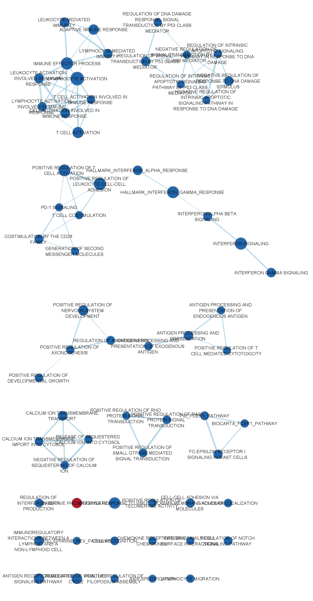

```{=html}
<style type="text/css">
  body{
  font-size: 11.5pt;
}
</style>
```

## Report Set-up

Load all required packages for this report and define some global customization settings.

```{r message = FALSE, warning=FALSE}
# for knitting the .rmd file to .html
if (! requireNamespace("knitr", quietly = TRUE)) {
  install.packages("knitr")
}
if (! requireNamespace("kableExtra", quietly = TRUE)) {
  install.packages("kableExtra")
}

# for creating models and analyzing expression data
if (! requireNamespace("edgeR", quietly = TRUE)) {
  BiocManager::install("edgeR")
}
if (! requireNamespace("dplyr", quietly = TRUE)) {
  install.packages("dplyr")
}

# for creating plots
if (! requireNamespace("ggplot2", quietly = TRUE)) {
  install.packages("ggplot2")
}
if (! requireNamespace("VennDiagram", quietly = TRUE)) {
  install.packages("VennDiagram")
}
if (! requireNamespace("ComplexHeatmap", quietly = TRUE)) {
  BiocManager::install("ComplexHeatmap")
}
if (! requireNamespace("circlize", quietly = TRUE)) {
  BiocManager::install("circlize")
}

library(edgeR)
library(dplyr)
library(ggplot2)

# wraps lines that are too long
knitr::opts_chunk$set(tidy.opts=list(width.cutoff=80), tidy=TRUE)
# set default behaviors for all chunks
knitr::opts_chunk$set(warning = FALSE, message = FALSE)
```

All table and figure outputs in this report are rendered using the knitr package @knitr, and kableExtra package @kableExtra for styling. Some codes in this report are adapted from Lecture 10 - GSEA @lec10 and Lecture 12 - Enrichment Map and other Cytoscape Appsother Cytoscape Apps @lec12.

------------------------------------------------------------------------

# Introduction

## Background on the Data Set

Glucocorticoids (GC) is a class of steroid hormones that plays a role in regulating the immune system and certain aspects of the immune function, such as inflammation. The most common naturally-produced GC hormone in humans is cortisol, which are produced by the adrenal glands. Due to GC's potent anti-inflammatory effects, several synthetic forms of GC are used as immunosuppressive drugs to treat various medical conditions such as asthma, allergies, autoimmune disorders, and cancer. @GSE-paper

The data set used in this report comes from Quatrini et al. (2022)'s paper: **Glucocorticoids inhibit human hematopoietic stem cell differentiation toward a common ILC precursor** @GSE-paper, where they analyzed the the role of GC on regulating innate lymphoid cells (ILCs) differentiation, including cytotoxic natural killer cells and helper ILCs, from human hematopoietic stem cells (HSCs). The RNA-seq data set used in this report is a part of the overall study; it evaluates the effect of the presence of Dexamethasone (DEX), a glucocorticoid medication, on gene expressions of HSCs. The raw data set is downloaded from the NCBI Gene Expression Omnibus, with ID [**GSE186950**](https://www.ncbi.nlm.nih.gov/geo/query/acc.cgi?acc=GSE186950). @GSE

## Recap of Assignment \#1 and \#2

In [Assignment 1](https://github.com/bcb420-2023/JunNi_Du/blob/main/a1.Rmd), I performed initial pre-processing and normalization of the data set. The raw data set contains 2 groups, control (CTRL) and conditioned (DEX), with 3 samples in each group: AF25, AF26, AF29. The data set initially contained gene expressions of 58683 genes, but 46243 genes were removed due to low counts with less than 1 count per million in at least 3 samples, leaving 12440 genes.

In the original data set, genes are labeled in a mix of HUGO gene symbols, GenBank accession IDs, EMBL identifiers, etc. Using the biomaRt  package @biomaRt, we attempted to map non-HUGO identifiers to their corresponding HUGO gene symbols, but had to discard 847 (6.8%) genes with no matches, leaving a final set of 11593 unique genes. 

```{r warning=FALSE, message=FALSE, out.width = "75%"}
knitr::include_graphics('figures/A2/raw_fltr_data_cpm.png')
```

**Figure 1.** *log2 CPM Distributions of gene expressions of each sample in the data set, after filtering out genes with low-counts or without HUGO gene symbol match, and before TMM normalization. This figure is adapted from Assignment 1 with slight aesthetic modifications.*

As shown in Fig.1, The filtered data set is approximately normally distributed with no outlier samples, and therefore we normalized the data using the Trimmed Mean of M-values (TMM) method, via the edgeR package. @edgeR

In [Assignment 2](https://github.com/bcb420-2023/JunNi_Du/blob/main/A2_JunNi_Du.Rmd), using the normalized data set, we built two models to identify the set of significantly differentially expressed genes. Then, we selected one of the models (a treatment-only model built using the exact test of the edgeR package @edgeR) and performed thresholded over-representation analysis on genes that are significantly differentially expressed, based on a threshold of FDR-corrected p-value < 0.05.

In this assignment, we'll start with the result from the treatment-only exact test model and load it as an .rds file. The `top_et.rds` file can be generated by running `saveRDS(top_et, 'top_et.rds')` after running all code chunks in [A2_JunNi_Du.Rmd](https://github.com/bcb420-2023/JunNi_Du/blob/main/A2_JunNi_Du.Rmd).

```{r warning=FALSE, message=FALSE, tidy=TRUE}
# load the output of the exact test model from Assignment 2
top_et <- readRDS('top_et.rds')
et_output <- top_et$table

# calculate rank for each gene
et_output[,"rank"] <- -log(et_output$PValue,base = 10) * sign(et_output$logFC)
et_output <- et_output[order(et_output$rank),]
```

------------------------------------------------------------------------

# Non-thresholded Gene set Enrichment Analysis

In Assignment 2, we performed thresholded over-representation analysis on our data set. Some of the down sides with ORA are that (1) the threshold is arbitrary with different thresholds resulting in different outputs, and (2) many weaker signals are ignored due to the thresholding. Here, we use Gene Set Enrichment Analysis (GSEA) @gsea to perform a non-thresholded enrichment analysis.

## Non-thresholded Gene set Enrichment Analysis Questions
**1. What method did you use? What genesets did you use? Make sure to specify versions and cite your methods.**

I using GSEA v4.3.2 for Windows to perform a GSEAPreranked analyses.

```{r warning=FALSE, message=FALSE, tidy=TRUE}
# Create a rank file (.rnk) for GSEA
rnk <- data.frame(rownames(et_output), et_output$rank)
colnames(rnk) <- c('GeneName', 'rank')
write.table(rnk, file = "./dex_ctrl.rnk", sep = "\t", col.name = TRUE, row.names = FALSE, quote = FALSE)
```

Using the rank (.rnk) file of our dataset, together with the [gene set file (.gmt)](https://github.com/bcb420-2023/JunNi_Du/blob/main/Human_GOBP_AllPathways_no_GO_iea_March_02_2023_symbol.gmt) from baderLab released on March 02, 2023 @bader, we run GSEAPreranked with the following parameters:

* Number of permutation: 1000
* Coppase/Remap to gene symbols: No Collapse
* Enrichment statistic: weighted
* Max size: 500
* Min size: 15

Max size and min size represent upper and lower bounds on the size of the gene sets outputted. A few different thresholds were experimented to ensure that an enough number of genesets are returned without including too many weaker signals. (details in journal)

After the query is completed, we get two tables, one for up-regulated gene sets and the other for down-regulated.

```{r warning=FALSE, message=FALSE, tidy=TRUE}
gsea_upreg <- read.table(file = 'gsea_report_for_na_pos_1680460999801.tsv', sep = '\t', header = TRUE, fill = TRUE)
gsea_downreg <- read.table(file = 'gsea_report_for_na_neg_1680460999801.tsv', sep = '\t', header = TRUE, fill = TRUE)
```

**2. Summarize your enrichment results.**

The GSEA pre-ranked analysis identified `r nrow(gsea_upreg)` up-regulated gene sets out of `r sum(nrow(gsea_upreg), nrow(gsea_downreg))` total gene sets, with `r nrow(gsea_upreg[which(gsea_upreg$NOM.p.val < 0.05),])` gene sets having nominal p-value < 0.05 and `r nrow(gsea_upreg[which(gsea_upreg$FDR.q.val <0.25),])` gene set having FDR q-value < 0.25, which is an indication of significant enrichment.

For down-regulated gene sets, `r nrow(gsea_downreg)` down-regulated gene sets out of `r sum(nrow(gsea_downreg), nrow(gsea_upreg))` total gene sets were identified, with `r nrow(gsea_downreg[which(gsea_downreg$NOM.p.val < 0.05),])` gene sets having nominal p-value < 0.05 and `r nrow(gsea_downreg[which(gsea_downreg$FDR.q.val <0.25),])` gene set having FDR q-value < 0.25, which indicates significant enrichment.

```{r warning=FALSE, message=FALSE, tidy=TRUE}
pathway_names <- sapply(stringr::str_split(gsea_upreg$NAME, '%'),'[',1:2)
pathway_names <- t(pathway_names)
gsea_upreg <- cbind(pathway_names, gsea_upreg)

upreg <- gsea_upreg[,c('1', '2','SIZE','NES','NOM.p.val',"FDR.q.val")]
colnames(upreg) <- c('Term', 'Data Source','Size','Normalized Enrichment Score','Nominal p-value',"FDR q-value")
kableExtra::kable_paper(knitr::kable(head(upreg[which(upreg$'Nominal p-value' < 0.05),]), format = "html", digits=10))
```

**Table 1A.** *Significantly up-regulated gene sets as outputted by GSEA pre-ranked analysis, ordered by descending normalized enrichment score. Significance is determined by having a nominal p-value < 0.05.*

```{r warning=FALSE, message=FALSE, tidy=TRUE}
pathway_names <- sapply(stringr::str_split(gsea_downreg$NAME, '%'),'[',1:2)
pathway_names <- t(pathway_names)
gsea_downreg <- cbind(pathway_names, gsea_downreg)

downreg <- gsea_downreg[,c('1', '2','SIZE','NES','NOM.p.val',"FDR.q.val")]
colnames(downreg) <- c('Term', 'Data Source','Size','Normalized Enrichment Score','Nominal p-value',"FDR q-value")
kableExtra::kable_paper(knitr::kable(head(downreg[which(downreg$'Nominal p-value' < 0.05),]), format = "html", digits=10))
```

**Table 1B.** *Significantly down-regulated gene sets as outputted by GSEA pre-ranked analysis, ordered by ascending normalized enrichment score. Significance is determined by having a nominal p-value < 0.05.*

**3. How do these results compare to the results from the thresholded analysis in Assignment #2. Compare qualitatively. Is this a straight forward comparison? Why or why not?**

Here we load the top pathway terms returned by up-regulated/down-regulated genes from Assignment 2. The `summary_A2.rds` file can be generated by running `saveRDS(summary_df, 'summary_A2.rds')` after running all code chunks in [A2_JunNi_Du.Rmd](https://github.com/bcb420-2023/JunNi_Du/blob/main/A2_JunNi_Du.Rmd).

```{r warning=FALSE, message=FALSE, tidy=TRUE}
summary_A2 <- readRDS('summary_A2.rds')

upreg_comparison <- data.frame(summary_A2$`top_terms_up-reg`, tolower(upreg$Term[1:8]))
downreg_comparison <- data.frame(summary_A2$`top_terms_down-reg`, tolower(downreg$Term[1:8]))
colnames(upreg_comparison) <- c('A#2 ORA Top Terms (Up-Regulated)','A#3 GSEA Top Terms (Up-Regulated)')
colnames(downreg_comparison) <- c('A#2 ORA Top Terms (Down-Regulated)','A#3 GSEA Top Terms (Down-Regulated)')
kableExtra::kable_paper(knitr::kable(upreg_comparison, format = "html", digits=10))
```

**Table 2A.** *Top pathways related to up-regulated genes, as outputted by thresholded analysis (left) and non-thresholded analysis (right). Results from GSEA are converted to lower case for better readability.*

```{r warning=FALSE, message=FALSE, tidy=TRUE}
kableExtra::kable_paper(knitr::kable(downreg_comparison, format = "html", digits=10))
```

**Table 2B.** *Top pathways related to down-regulated genes, as outputted by thresholded analysis (left) and non-thresholded analysis (right). Results from GSEA are converted to lower case for better readability.*

As we can see from Table 2, there are many common or similar pathways returned by both the thresholded analysis and non-thresholded analysis. Some of these include neutrophil degranulation, T-cell signaling, and signal transduction. This is not a straightforward comparison because the two types of analyses returns different information. For example, the thresholded ORA analysis returns fold counts, while GSEA returns enrichment scores. In addition, the data sources that the two methods use are also slightly different: in thresholded ORA we used a combination of GO:BP, KEGG, REAC, and Wikipathway, while in GSEA we use the gene set file from the Bader lab which includes several other sources. Therefore, the qualitative comparison can only serve as an exploratory overview of the two methods and cannot be used to derive any direct conclusions.

------------------------------------------------------------------------

# Cytoscape Visualization

We used Cytoscape 3.9.1 for Windows @cytoscape, along with Apps in the EnrichmentMap Pipeline Collection (EnrichmentMap, AutoAnnotate, WordCloud, clusterMaker2) @EM to generate enrichment map networks for the differentially expressed gene sets.

## Cytoscape Visualization Questions

**1. Create an enrichment map - how many nodes and how many edges in the resulting map? What thresholds were used to create this map? Make sure to record all thresholds. Include a screenshot of your network prior to manual layout.**

The enrichment map was created using the following thresholds:  
(note that the enrichment, annotation, and expression files are automatically captured from the GSEA results folder)

* Enrichment Pos: ['gsea_report_for_na_pos_1680460999801.tsv'](https://github.com/bcb420-2023/JunNi_Du/blob/main/gsea_report_for_na_pos_1680460999801.tsv)
* Enrichment Neg: ['gsea_report_for_na_neg_1680460999801.tsv'](https://github.com/bcb420-2023/JunNi_Du/blob/main/gsea_report_for_na_neg_1680460999801.tsv)
* GMT: ['Human_GOBP_AllPathways_no_GO_iea_March_02_2023_symbol.gmt'](https://github.com/bcb420-2023/JunNi_Du/blob/main/Human_GOBP_AllPathways_no_GO_iea_March_02_2023_symbol.gmt)
* Expressions: ['dex_ctrl.rnk'](https://github.com/bcb420-2023/JunNi_Du/blob/main/dex_ctrl.rnk)

* FDR q-value cutoff 0.25  
* p-value cutoff 0.05  
* gene-set similarity filtering cutoff 0.375 (with default metric: Jaccard+Overlap combined)

The enrichment map has 63 nodes and 71 edges.

```{r warning=FALSE, message=FALSE}

```

**Figure 2.** *Enrichment map of the significant gene sets and pathways, prior to annotation and manual layout. Each node represent a pathway, with red representing up-regulation and blue representing down-regulation. Edges represent similarity between the pathways with thicker edge corresponding to higher similarity score.*

**2. Annotate your network - what parameters did you use to annotate the network. If you are using the default parameters make sure to list them as well.**

Using the AutoAnnotate App available in Cytoscape, the enrichment map is annotated with the following parameters:  

* Max number of annotations: 10
* Cluster Options: Use clusterMaker App  
  * Cluster algorithm: MCL Cluster
  * Edge weight column: None
* Label Column: Name
* Label Algorithm: WordCloud: Adjacent Words (default)
* Max words per label: 3
* Minimum word occurrence: 1
* Adjacent word bonus: 8


**3. Make a publication ready figure - include this figure with proper legends in your notebook.**

The enrichment map below was created using the parameters above, arranged used GoSE layout and spatially-rearranged to be more compact.

```{r warning=FALSE, message=FALSE}

```

**Figure 3.** *Enrichment map of the significant gene sets and pathways, after annotation and layout adjustments. Each node represent a pathway, with red representing up-regulation and blue representing down-regulation. Edges represent similarity between the pathways with thicker edge corresponding to higher similarity score. The network is re-arranged used GoSE layout and manually adjusted to be more compact.*

**4. Collapse your network to a theme network. What are the major themes present in this analysis? Do they fit with the model? Are there any novel pathways or themes?**

```{r warning=FALSE, message=FALSE}

```

**Figure 4.** *Theme network of the significant gene sets and pathways. Each node represent a pathway, with red representing up-regulation and blue representing down-regulation. Edges represent similarity between the pathways (combined similarity coefficient > 0.375) with thicker edge corresponding to higher similarity score. The network is re-arranged used GoSE layout and manually adjusted to be more compact.*

Per the above figure, some of the major themes include immune system (e.g.lymphocyte mediated immunity, antigen receptor-mediated signaling pathway, regulation of interferon-beta production, defense response to virus, etc.) and cell signaling (e.g. signal transduction protein, nervous system axonogenesis, activation involved response). All the gene sets in these themes are down-regulated, which fits our models where the presence of dexamethasone down-regulates immune system responses and cell signaling. This also aligns with the study of the mechanism of dexamethasone and other glucocorticoids, where they down-regualtes immune cell signaling and responses to suppress inflammation responses.

Two novel themes that are shown in the annotated clusters and the theme network but not in the top hits of the models are 'p53 class mediator' and 'sequestering calcium ion'. Additional discussion regarding these findings can be found in question 2 of [Interpretation and Detailed View of Results].

------------------------------------------------------------------------

# Interpretation and Detailed View of Results
Background and pre-processing of the data set can be found here: 

* [Background on the Data Set]

Questions from previous sections can be found here: 

* [Non-thresholded Gene set Enrichment Analysis Questions]
* [Cytoscape Visualization Questions]


**1. Do the enrichment results support conclusions or mechanism discussed in the original paper? How do these results differ from the results you got from Assignment #2 thresholded methods**

Yes, the enrichment results do support some the mechanisms discussed in the original paper. In the original paper, the authors were investigating the effect of glucocorticoids (GC) on helper innate lymphoid cells (hILCs), and they concluded that GC suppresses hILC development and activity by observing a lower level of cytokines in the presence of GC. @GSE-paper This supports our finding where one of the major themes in the enrichment map is "lymphocyte mediated immunity", which is down-regulated with the presence of glucocorticoids (e.g. dexamethasone). Another major theme is down-regulated "processing exogenous antigen", which also aligns with the mechanism of GC where GC impairs differentiation and antigen presenting function of dendritic cells. @antigen

As shown in Table 2A and 2B, the enrichment results are mostly similar to the thresholded results from Assignment 2, with some differences in wordings. For the annotated enrichment map, the cluster names do differ in that they are more general. For example, we have "activation involved response" in our network, instead of specifying activation of what kinds of cells. However, this is expected as they represent multiple similar gene sets/pathways that have similar but non-identical functions.

**2. Can you find evidence, i.e. publications, to support some of the results that you see. How does this evidence support your result?**

- Interferons are a group of signaling proteins made and released by host cells in response to the presence of viruses. GC suppressed immune cell signalings, which also include interferons. @interferon This supports our result where "interferon 913531 hsa" is one of the major theme that is downregulated.

Two novel themes that are shown in the annotated clusters and the theme network, but not in the top hits of the models, are 'p53 class mediator' and 'sequestering calcium ion'. p53 is a tumor suppressor protein that regulates cell division. In a paper by Sengupta et al. (2000), it is said that dexamethasone-activated endogenous and exogenous GC receptor inhibit p53-dependent functions@p53, so it makes sense to see this theme down-regulated in our network. Regarding calcium ion, GC increase renal calcium excretion by decreasing calcium re-absorption @calcium. This aligns with our finding that 'sequestering (storage/retention) calcium ion' is downregulated in our network. 

**Using your networks and results from the previous section add one of the following:**

I chose to answer question 3, regarding dark matter.

## Dark Matter

**3. Sometimes the most interesting information is the gene that has no information. In this type of pathway analysis we can only discover what we have already described previously in the literature or pathway databases. Often pathways found in one disease are applicable to other diseases so this technique can be very helpful. It is important to highlight any genes that are significantly differentially expressed in your model but are not annotated to any pathways. We refer to this set of genes as the dark matter.**

```{r warning=FALSE, message=FALSE, tidy=TRUE}
# extract out the sets of genes required for the Venn diagram.
gene_sets <- fgsea::gmtPathways('Human_GOBP_AllPathways_no_GO_iea_March_02_2023_symbol.gmt')

# all annotated genes
Annotated <- unique(unlist(gene_sets))

# all enriched genes
Enriched <- unique(unlist(gene_sets[c(gsea_upreg$NAME, gsea_downreg$NAME)]))

# all expressed genes
genes_expressed <- readRDS('raw_fltr_matrix.rds')
Expressed<- unique(rownames(genes_expressed))
```

```{r warning=FALSE, message=FALSE, tidy=TRUE}
# create Venn diagram
venn_diag<-VennDiagram::draw.triple.venn( area1=length(Annotated), area2=length(Enriched), area3 = length(Expressed),
          n12 = length(intersect(Annotated,Enriched)), n13=length(intersect(Annotated,Expressed)),
          n23 = length(intersect(Enriched,Expressed)), 
          n123 = length(intersect(Annotated,intersect(Enriched,Expressed))),
          category = c("Annotated","Enriched","Expressed"),
          fill = hcl.colors(3, palette = "Sunset"),fontfamily ="Arial",cat.fontfamily = "Arial",cat.cex = 1.2,
)
grid::grid.draw(venn_diag)
```

**Figure 5.** *Venn diagram showing the overlap between all genes with annotation (from the gene set file), all expressed genes in the dataset, and all genes in the enriched gene sets.*

Per the Venn diagram, `r length(intersect(Annotated,intersect(Enriched,Expressed)))` out of `r length(Expressed)` filtered expressed genes (81.76\%) were annotated and enriched. This is good as it is an indication that the outputs of our enrichment analyses incorporates the majority of the expression data. Here, we'll focus on the 2114 genes that were not enriched, which contains 1620 expressed genes that are not enriched nor annotated, and 494 genes that are annotated but not enriched.

```{r warning=FALSE, message=FALSE}
# set of genes that are annotated but not enriched
anno_no_enrich <- setdiff(intersect(Expressed, Annotated), Enriched)
anno_no_enrich <- et_output[anno_no_enrich,]
# filter out genes that are not significantly differentially expressed
anno_no_enrich <- anno_no_enrich[which(anno_no_enrich$FDR<0.05),]

# set of genes with no annotation
no_anno <- setdiff(Expressed, Annotated)
no_anno <- et_output[no_anno,]
# filter out genes that are not significantly differentially expressed
no_anno <- no_anno[which(no_anno$FDR<0.05),]
```

```{r warning=FALSE, message=FALSE}
rmarkdown::paged_table(anno_no_enrich[order(anno_no_enrich$rank, decreasing = TRUE),c('FDR','rank')])
```

**Table 3A.** *List of genes that are expressed in the dataset and annotated, but not enriched in any pathways.*

```{r warning=FALSE, message=FALSE}
rmarkdown::paged_table(no_anno[order(no_anno$rank, decreasing = TRUE),c('FDR','rank')])
```

**Table 3B.** *List of genes that are expressed in the dataset, but do not have annotations.*

Based on Table 3, we briefly examine the genes that are significantly expressed but not annotated or not enriched:

* CORO2A: encodes a member of the WD repeat protein family which is involved in a variety of cellular processes, including cell cycle progression, signal transduction, apoptosis, and gene regulation.
* GLDN: encodes a protein that promotes formation of the nodes of Ranvier in the peripheral nervous system. 
* SH2D4A: encodes a protein that enables phosphatase binding activity; located in cytosol.

All the above genes have very generic function descriptions and are involved in multiple biological pathways, making it difficult to derive any significant findings. We'll use two heatmaps to visualize these genes, to see if their expression patterns differ between the control vs. test condition.

**3.i. Include a heatmap of any significant genes that are not annotated to any of the pathways returned in the enrichment analysis.**
```{r warning=FALSE, message=FALSE}
# creating normalized CPM for heatmap
dge <- edgeR::DGEList(counts = genes_expressed, group = c('CTRL', 'CTRL', 'CTRL', 'DEX', 'DEX', 'DEX'))

# calculate normalization factor
dge <- calcNormFactors(dge)
# get the normalized data
normalized_cpm <- cpm(dge)
```

```{r warning=FALSE, message=FALSE}
# creating heatmap matrix
heatmap_matrix_1 <- t(scale(t(normalized_cpm[rownames(anno_no_enrich),])))
heatmap_col = circlize::colorRamp2(c(min(heatmap_matrix_1), 0, max(heatmap_matrix_1)), 
                                   c("blue", "white", "red"))  

# creating treatment annotation
treat_colours <- c("orange", "darkblue")
names(treat_colours) <- c("DEX", "CTRL")
treatment_col <- ComplexHeatmap::HeatmapAnnotation(df=data.frame(
  treatment = rep(c("CTRL", "DEX"), c(3, 3))),
  col = list(treatment = treat_colours))

# Create the heatmap
heatmap_anno_no_enrich <- ComplexHeatmap::Heatmap(as.matrix(heatmap_matrix_1),
                           cluster_rows = TRUE,
                           cluster_columns = TRUE,
                           show_row_dend = TRUE,
                           show_column_dend = TRUE,
                           col = heatmap_col,
                           show_column_names = TRUE,
                           show_row_names = FALSE,
                           show_heatmap_legend = TRUE,
                           top_annotation = treatment_col,
                           column_title = "Differential Gene Expressions of Genes \nThat Are Annotated but Not Enriched",
                           name="row-normalized \ngene expression"
  )
heatmap_anno_no_enrich
```

**Figure 6.** *Heatmap of row-normalized gene expressions, in counts-per-million (CPM), of all genes that are expressed in the dataset (thresholded based on p-value (FDR) < 0.05) and annotated, but not enriched in GSEA. In each sample of the data set. Column-wise, each sample is hierarchically clustered based on the similarity of their gene expressions. Row-wise, each gene is hierarchically clustered based on their expressions across the samples.*

As we can see from the heatmap, there are some distinction of expression pattern between the control and conditioned group. This distinction is not definite (e.g. on the bottom left, we can see a few areas where genes are up-regulated in two of the three samples but down-regulated in the other). Although the distinction does exist, this heat map only contains 28 genes (significantly differentially expressed, annotated, but not enriched), and is unlikely to contain any major significant pathways that we did not already identify.

**3.ii. Include a heatmap of any significant genes that are not annotated to any pathways in entire set of pathways used for the analysis.**

```{r warning=FALSE, message=FALSE}
# creating heatmap matrix
heatmap_matrix_2 <- t(scale(t(normalized_cpm[rownames(no_anno),])))
heatmap_col = circlize::colorRamp2(c(min(heatmap_matrix_2), 0, max(heatmap_matrix_2)), 
                                   c("blue", "white", "red"))  

# creating treatment annotation
treat_colours <- c("orange", "darkblue")
names(treat_colours) <- c("DEX", "CTRL")
treatment_col <- ComplexHeatmap::HeatmapAnnotation(df=data.frame(
  treatment = rep(c("CTRL", "DEX"), c(3, 3))),
  col = list(treatment = treat_colours))

# Create the heatmap
heatmap_no_anno <- ComplexHeatmap::Heatmap(as.matrix(heatmap_matrix_2),
                           cluster_rows = TRUE,
                           cluster_columns = TRUE,
                           show_row_dend = TRUE,
                           show_column_dend = TRUE,
                           col = heatmap_col,
                           show_column_names = TRUE,
                           show_row_names = FALSE,
                           show_heatmap_legend = TRUE,
                           top_annotation = treatment_col,
                           column_title = "Differential Gene Expressions of Genes That Are Not Annotated",
                           name="row-normalized \ngene expression"
  )
heatmap_no_anno

```

**Figure 7.** *Heatmap of row-normalized gene expressions, in counts-per-million (CPM), of all genes that are expressed in the dataset (thresholded based on p-value (FDR) < 0.05) but not annotated. In each sample of the data set. Column-wise, each sample is hierarchically clustered based on the similarity of their gene expressions. Row-wise, each gene is hierarchically clustered based on their expressions across the samples.*

Similar to the previous heatmap (annotated but not enriched), this heatmap also clustered some distinction in gene expression patterns between the two groups, but each cluster is not very homogeneous. For example, there exists bands of blue (downregulated) genes in the red area (cluster of up-regulated genes).Although the distinction does exist, this heat map only contains 142 genes (significantly differentially expressed but not annotated). A solution to these dark matter genes is to use a larger set of pathways that could potentially include these genes, but the downside to this is that it could also introduce less-relevant pathways in our network result.

------------------------------------------------------------------------

# References
